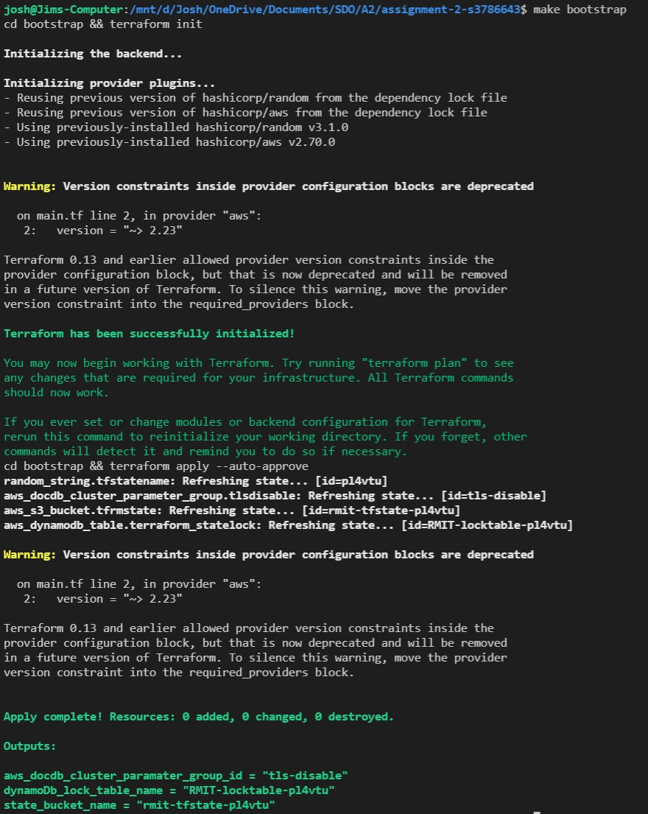
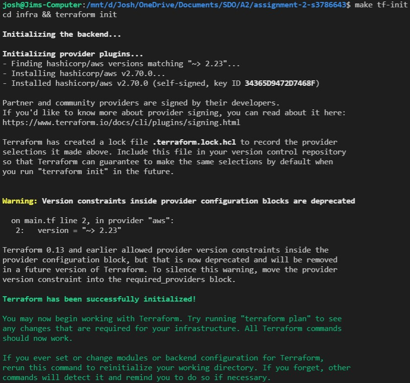
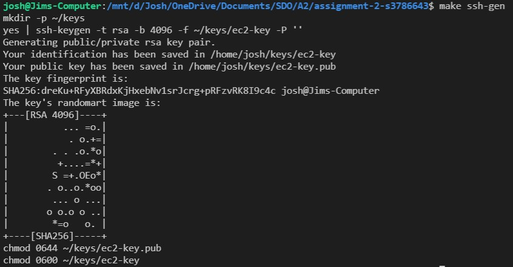
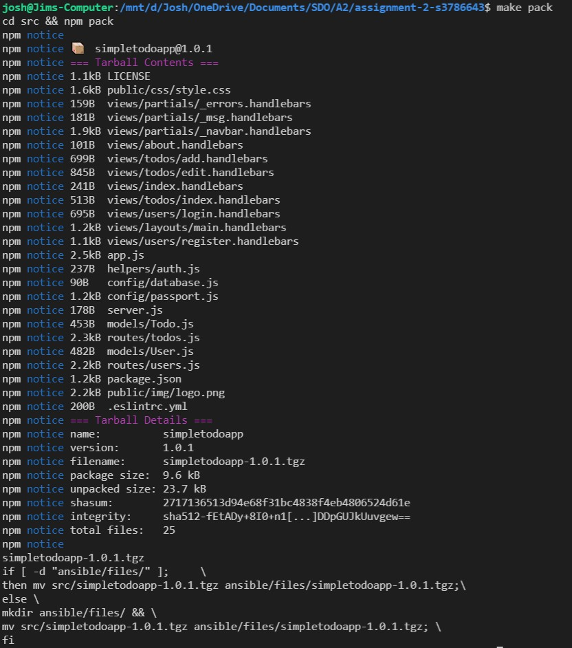
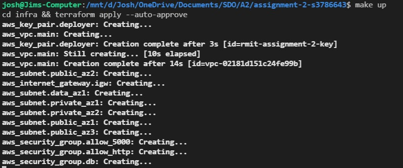

# Simple Todo App with MongoDB, Express.js and Node.js
The ToDo app uses the following technologies and javascript libraries:
* MongoDB
* Express.js
* Node.js
* express-handlebars
* method-override
* connect-flash
* express-session
* mongoose
* bcryptjs
* passport
* docker & docker-compose

## What are the features?
You can register with your email address, and you can create ToDo items. You can list ToDos, edit and delete them. 

# How to use
First install the depdencies by running the following from the root directory:
```
npm install --prefix src/
```

To run this application locally you need to have an insatnce of MongoDB running. A docker-compose file has been provided in the root director that will run an insatnce of MongoDB in docker. TO start the MongoDB from the root direction run the following command:

```
docker-compose up -d
```

Then to start the application issue the following command from the root directory:
```
npm run start --prefix src/
```

The application can then be accessed through the browser of your choise on the following:

```
localhost:5000
```

## Testing

Basic testing has been included as part of this application. This includes unit testing (Models Only), Integration Testing & E2E Testing.

### Linting:
Basic Linting is performed across the code base. To run linting, execute the following commands from the root directory:

```
npm run test-lint --prefix src/
```

### Unit Testing
Unit Tetsing is performed on the models for each object stored in MongoDB, they will vdaliate the model and ensure that required data is entered. To execute unit testing execute the following commands from the root directory:

```
npm run test-unit --prefix src/
```

### Integration Testing
Integration testing is included to ensure the applicaiton can talk to the MongoDB Backend and create a user, redirect to the correct page, login as a user and register a new task. 

Note: MongoDB needs to be running locally for testing to work (This can be done by spinning up the mongodb docker container).

To perform integration testing execute the following commands from the root directory:

```
npm run test-integration --prefix src/
```

### E2E Tests
E2E Tests are included to ensure that the website operates as it should from the users perspective. E2E Tests are executed in docker containers. To run E2E Tests execute the following commands:

```
chmod +x scripts/e2e-ci.sh
./scripts/e2e-ci.sh
```

## Deployable Package
A command has been included that allows you to package up the application into a deployable artifact (tarball). To do this, from the root directory, enter the following command:

```
make pack
```
This command will pack the application into a tar and copy it into the `ansible/files` folder that can be used by ansible to deploy to a target machine. 


## Terraform
### Bootstrap
A set of bootstrap templates have been provided that will provision a DynamoDB Table, S3 Bucket & Option Group for DocumentDB in AWS. To set these up, ensure your AWS Programmatic credentials are set in your console and execute the following command from the root directory

```
make bootstrap
```

### Initalising your TF Repo
To initialise your terraform repo, run the following commands from your root directory

```
make tf-init
```

### Validate your TF Code
To validate & format your terraform repo, run the following command from your root directory

```
make tf-validate
```

### Deployment

#### How to Deploy
- All commands are run from the root directory
- AWS credentials must be up to date. For more information, visit https://docs.aws.amazon.com/cli/latest/userguide/cli-configure-files.html
1. If this is the first time deploying, run `make bootstrap`

2. If this is the first time deploying, run `make tf-init`

3. If there are not already files named ec2-key and/or ec2-key.pub in ~/keys/, run `make ssh-gen`

4. If there is not already a .tgz file in ansible/files/, or if a change has been made to the source code of the application, run `make pack`.

5. Run `make up`


#### run-ansible.sh
This script is run as part of make up. It dynamically generates inventory.yml during deployment. This file stores the public IP address of the infrastructure for use later. It also stores a URL for the DocumentDB cluster that contains the username and password required for the application to access the database.
The script obtains these values from outputs defined in infra/outputs.tf.
The names of these outputs are:
- public_ip
- db_dns_name
- db_pw
- db_username

The inventory.yml file should never be stored on source control, as it contains critical security information.

#### playbook.yml
The playbook contains a number of steps that are run after all infrastructure has been deployed. It is responsible for deploying the application to the infrastructure.
- First, it sends the .tgz generated by make pack and unarchives it. The current location the file is sent is the home folder of the user ec2-user. This is to prevent permission issues.
- Then, it downloads and installs NodeJS.
- It then installs the dependencies required by the application using npm
- Finally, it creates a service that starts the application

#### The service
The playbook creates a .service file using the service.tpl file in ansible/templates.
The service sets the DB_URL environment variable to the value found in inventory.yml.
It also sets the WorkingDirectory to /home/ec2-user/package, the directory where the application files were extracted.

The service automatically starts the application on reboot.

### Makefile
#### up:
Provided that one has up-to-date AWS credentials and has already run `make bootstrap`, `make pack` and `make ssh-gen`, `make up` will run everything necessary to deploy the application.
There are four steps in make up:

1. terraform apply

- This applies all the infrastructure defined in infra/, creating the VPC, EC2, DB and other required infrastructure

2. run-anisble.sh

- This step generates an inventory.yml file for use in the next step.
- inventory.yml defines the public IP address required for SSH as well as the address for accessing the database, which includes the username and password.

3. ansible-playbook
- This step deploys the application.
- First, it sends the .tgz generated by make pack and unarchives it.
- Then, it downloads and installs NodeJS.
- It then installs the dependencies required by the application using npm
- Finally, it creates a service that starts the application

4. Output dns name
- The final step is for convenience.
- Earlier in the deployment, the public-facing dns name that is used to connect to the application is printed. However, this is often buried by the ansible scripts. This step simply prints it again so you don't have to scroll up to find it.

#### down:
I added `cd infra && terraform destroy --auto-approve` to the down command in the Makefile to facilitate the removal of AWS resources to prevent unexpected charges

#### tf-init
The two -backend-config commands dynamically define the bucket and dynamodb_table variables for use in the remote backend. If these were hardcoded values, since S3 Buckets require globally unique names, others using this repo would be met with errors unless they manually updated the values.

### Infrastructure

#### EC2
The EC2 instance is set up with a variable class (instance_type) which defaults to t2.micro.
It has two security groups attached, the first allows access on port 5000 from anything within the VPC's cidr range. The load balancer uses this port to route HTTP traffic to the EC2. The second security group exposes port 22, allowing for SSH access to the instance for automatic deployment/remote maintenance.

The `"aws_ami"` data source defined in ec2.tf automatically obtains the latest Amazon Linux 2 AMI. The EC2 instance uses this AMI instead of a hard coded one so it is easier to stay up to date with patches. The filter can be changed by setting `ec2_ami_filter`, allowing you to change instance type.


#### DocumentDB
A security group that restricts inbound traffic to port 27017 and only allows traffic from the VPC has been attached to the database.
By restricting access to the database, it becomes more difficult for an attacker to attempt to access the database.
An engine version of 3.6 was applied to the database, as the 'tls-disable' parameter group specifies that it is for version 3.6 only.

The DocDB cluster supports multiple instances through the db_instance_count variable, which by default is set to 1. The class of the instances can also be defined using db_instance_size (Defaulting to db.t3.medium). The use of variables makes it easier to make modifications to the database without having to edit the code.


#### Load Balancer (Balancer, Listener and Target Group)
The load balancer is responsible for routing HTTP traffic to the specified port on the EC2 instance. In this case, port 5000.
The listener listens on port 80 (HTTP), and forwards requests to the target group. The target group then sends the requests to port 5000 on the EC2 instance through the target group attachment.

The load balancer has a security group that only permits internet-based traffic on port 80.

#### Remote Backend
The terraform state files are stored in an S3 bucket created during `make bootstrap`. They are also locked using DynamoDB. This permits multiple people to work on the deployment without having to worry about having an up to date statefile.

###### This project is licensed under the MIT Open Source License
